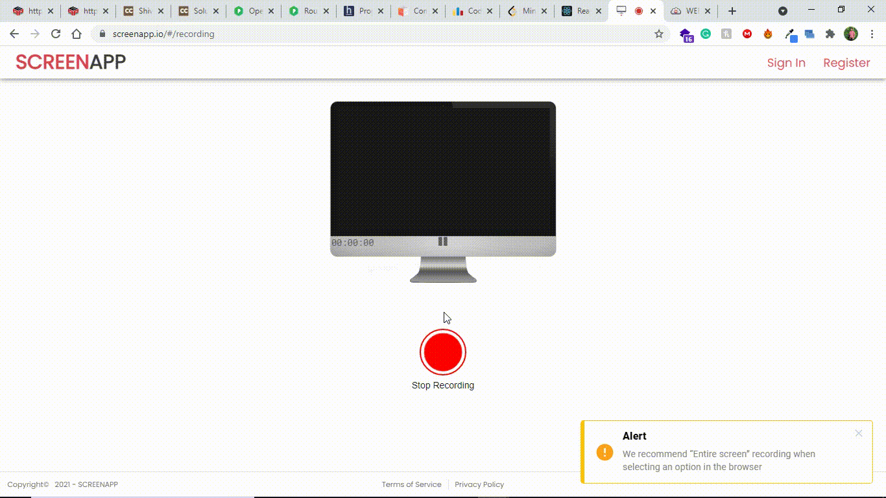

<p align="center">

</p>

## Tees and T's (Frontend)

This repository contains the frontend part of the main project Tees and T's which is an E-commerce web application built using the <b>MERN Stack</b>.

Want to see repository with Backend Stuff ?😇
<br>[Click here👈](https://github.com/shivanshugarg12800/Tees-and-S-Backend)

To view the application you need to run both Backend and Frontend simultaneously.

### Run the Backend files first to connect to the database.

#### \* Install all the dependencies.

```bash
npm install
```

#### \* then run

```bash
npm start
```

### Run the Frontend Files

#### \* Install all the dependencies.

```bash
npm install
```

#### \* then run

```bash
npm run start
```

### Preview of the website:

> HOME PAGE


> CART PAGE


